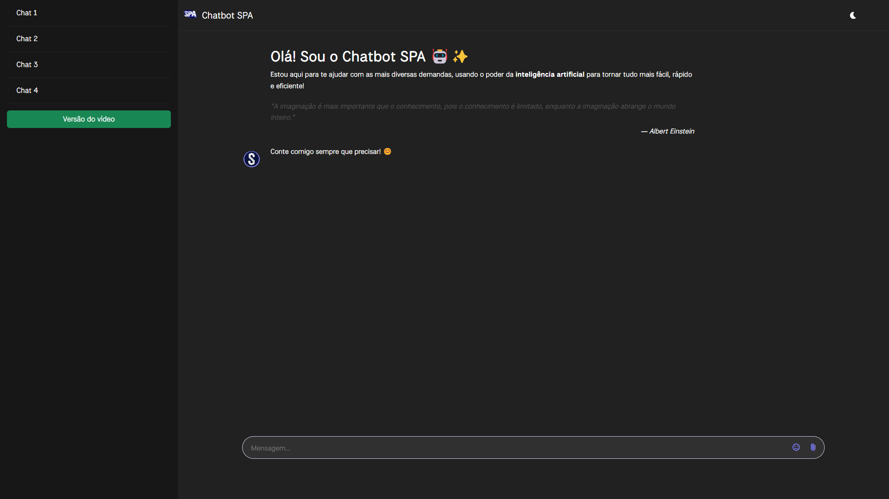

# 🤖 Chatbot IA — Desafio Estágio SPA
Este projeto é uma recriação personalizada de um chatbot com inteligência artificial, desenvolvido como parte de um desafio técnico proposto pela empresa Sistemas SPA para uma vaga de estágio.

O desafio consistia em recriar um chatbot IA com base no seguinte tutorial do YouTube:
📺 Como criar um chatbot com IA

## 🔧 Tecnologias Utilizadas
HTML5 + CSS3

JavaScript (Vanilla)

Gemini API

Layout responsivo

## 🚀 Melhorias e Criatividade
Além da simples reprodução do tutorial, utilizei minha criatividade para ir além do proposto, entregando um projeto com identidade própria e mais próximo de aplicações modernas. As principais melhorias são:

💬 Interface inspirada no ChatGPT — layout moderno e clean.

🌗 Botão de troca de tema (claro/escuro) — personalização visual para melhor experiência do usuário.

🏢 Apresentação personalizada acima do nome da empresa SPA — destaque elegante da proposta.

🎥 Botão para exibir a versão original do vídeo — permite comparar o projeto com o tutorial de origem.

## ⏱️ Tempo de Desenvolvimento
O projeto foi desenvolvido em apenas 2 dias, com foco em entregar um resultado funcional, esteticamente agradável e além das expectativas.

## 📸 Preview


## 📁 Como Executar
Clone o repositório:

```bash
git clone https://github.com/pedrokourly/Chatbot-IA
```

Abra o arquivo index.html no seu navegador.

Sem dependências externas ou instalação necessária — tudo simples e direto!

💡 Considerações Finais
Este projeto foi uma excelente oportunidade para exercitar minhas habilidades com JavaScript puro, criatividade em design e foco em experiência do usuário. Agradeço à Sistemas SPA pela proposta!

📬 Contato
Caso queira trocar uma ideia ou tirar dúvidas:

pedrohenriquekourly@hotmail.com
